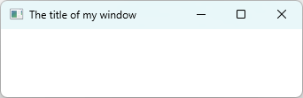

# C++ Examples with Graphical UIs [⬆](../README.md#top)

<table style="font-family:Helvetica,Arial;line-height:1.6;">
  <tr>
  <td style="border:0;padding:0 10px 0 0;min-width:25%;"></td>
  <td style="border:0;padding:0;vertical-align:text-top;">Directory <a href="."><strong><code>gui-examples\</code></strong></a> contains <a href="hhttps://isocpp.org/" rel="external" title="ISO C++">C++</a> code examples from various websites which use the <a href="https://en.wikipedia.org/wiki/Windows_API">Win32 API</a> on Windows. 
  It also includes build scripts (<a href="https://en.wikibooks.org/wiki/Windows_Batch_Scripting">batch files</a>, <a href="https://makefiletutorial.com/" rel="external">Make scripts</a>) for experimenting with <a href="hhttps://isocpp.org/" rel="external">C++</a> on a Windows machine.</td>
  </tr>
</table>

The code examples presented below can be built/run with the following tools:

| Build&nbsp;tool | Build&nbsp;file | Parent&nbsp;file | Environment(s) |
|:----------------|:-------------------|:------------|:---------------|
| [**`cmd.exe`**][cmd_cli] | [`build.bat`](./simple-window/build.bat) | &nbsp; | Windows only |
| [**`make.exe`**][make_cli] | [`Makefile`](./simple-window/Makefile) | [`Makefile.inc`](./Makefile.inc) | Any <b>a)</b> |

<b>a)</b> Here "Any" means "tested on Windows, Cygwin, MSYS2 and UNIX". &nbsp;

## `simple-window` Example

Example `simple-window` is presented in the online document [theForger's Win32 API Tutorial](http://www.winprog.org/tutorial/); it has the following directory structure :

<pre style="font-size:80%;">
<b>&gt; <a href="https://learn.microsoft.com/en-us/windows-server/administration/windows-commands/tree" rel="external">tree</a> /a /f . | <a href="https://learn.microsoft.com/en-us/windows-server/administration/windows-commands/findstr" rel="external">findstr</a> /v /b [A-Z]</b>
|   <a href="./simple-window/00download.txt">00download.txt</a>
|   <a href="./simple-window/build.bat">build.bat</a>
|   <a href="./simple-window/build.sh">build.sh</a>
|   <a href="./simple-window/CMakeLists.txt">CMakeLists.txt</a>
|   <a href="./simple-window/Doxyfile">Doxyfile</a>
|   <a href="./simple-window/Makefile">Makefile</a>
\---<b>src</b>
        <a href="./simple-window/src/main.cpp">main.cpp</a>
</pre>

Command [`build`](./simple-window/build.bat)`clean run` generates and executes the C++ program `build\Release\simple-windows.exe` :

<pre style="font-size:80%;">
<b>&gt; <a href="./simple-window/build.bat">build</a> -verbose clean run</b>
Delete directory "build"
Configuration: Release Platform: x64
Generate configuration files into directory "build"
Generate executable "simple-window.exe"
Execute "build\Release\simple-window.exe"
</pre>

 

<pre style="font-size:80%;">
<b>&gt; <a href="">make</a> clean run</b>
"C:/opt/msys64/usr/bin/rm.exe" -rf "build"
"C:/opt/msys64/mingw64/bin/g++.exe"  --std=c++17 -O2 -Wall -Wno-unused-variable  -o build/Release/simple-window.exe src/main.cpp -Wl,--subsystem,windows
build/Release/simple-window.exe
</pre>

<!--
## `windows-app` Example
-->

<!--
## Footnotes

[1] ***Batch files and coding conventions*** [↩](#anchor_01)

<dl><dd>
See section 4 "Tweak the &lt;thread&gt; C++ header" in blog post <a href="http://hectorhon.blogspot.com/2018/05/building-libpqxx-on-msys2-mingw-64-bit.html" rel="external"><i>Building libpqxx on MSYS2 MinGW 64 bit</i></a>.
</dd></dl>
-->

***

*[mics](https://lampwww.epfl.ch/~michelou/)/November 2024* [**&#9650;**](#top)
&nbsp;

<!-- link refs -->

[clang_cli]: https://clang.llvm.org/docs/ClangCommandLineReference.html#introduction
[cmake_cli]: https://cmake.org/cmake/help/latest/manual/cmake.1.html
[cmd_cli]: https://learn.microsoft.com/en-us/windows-server/administration/windows-commands/cmd
[gcc_cli]: https://man7.org/linux/man-pages/man1/g++.1.html
[make_cli]: https://ftp.gnu.org/old-gnu/Manuals/make-3.79.1/html_node/make_86.html
[msbuild_cli]: https://docs.microsoft.com/en-us/visualstudio/msbuild/msbuild-command-line-reference
[msvc_cli]: https://docs.microsoft.com/en-us/cpp/build/reference/compiler-command-line-syntax
